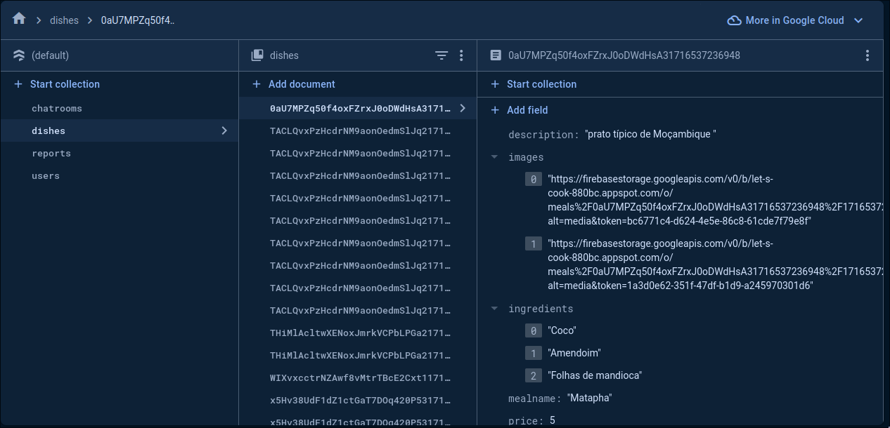
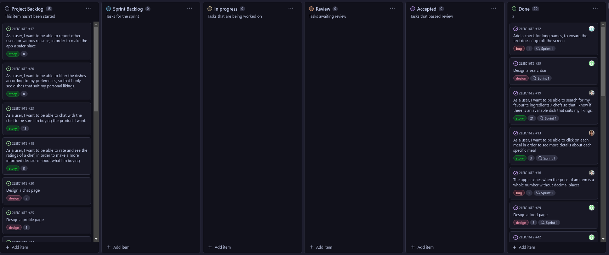

# Let's Cook Development Report

Welcome to the documentation pages of the Let's Cook App!

You can find here details about the the Let's Cook App, from a high-level vision to low-level implementation decisions, a kind of Software Development Report, organized by type of activities:

* [Business modeling](https://github.com/FEUP-LEIC-ES-2023-24/2LEIC16T2#Business-Modelling)
  * [Product Vision](https://github.com/FEUP-LEIC-ES-2023-24/2LEIC16T2#Product-Vision)
  * [Features and Assumptions](https://github.com/FEUP-LEIC-ES-2023-24/2LEIC16T2#Features-and-Assumptions)
  * [Elevator Pitch](https://github.com/FEUP-LEIC-ES-2023-24/2LEIC16T2#Elevator-pitch)
* [Requirements](https://github.com/FEUP-LEIC-ES-2023-24/2LEIC16T2#Requirements)
  * [User stories](https://github.com/FEUP-LEIC-ES-2023-24/2LEIC16T2/issues?q=is%3Aissue+sort%3Aupdated-desc+label%3Astory)
  * [Domain model](https://github.com/FEUP-LEIC-ES-2023-24/2LEIC16T2#Domain-model)
* [Architecture and Design](https://github.com/FEUP-LEIC-ES-2023-24/2LEIC16T2#Architecture-And-Design)
  * [Logical architecture](https://github.com/FEUP-LEIC-ES-2023-24/2LEIC16T2#Logical-Architecture)
  * [Physical architecture](https://github.com/FEUP-LEIC-ES-2023-24/2LEIC16T2#Physical-Architecture)
  * [Vertical prototype](https://github.com/FEUP-LEIC-ES-2023-24/2LEIC16T2#Vertical-Prototype)
* [Project management](https://github.com/FEUP-LEIC-ES-2023-24/2LEIC16T2#Project-Management)

Contributions are expected to be made exclusively by the initial team, but we may open them to the community, after the course, in all areas and topics: requirements, technologies, development, experimentation, testing, etc.

Please contact us!

Thank you!

## Authored by

* Allan Santos (up202109243)
* Filipe Gaio (up202204985)
* Henrique Fernandes (up202204988)
* José Sousa (up202208817)
* Leandro Martins (up202208001)

---

## Business Modelling

### Product Vision

Let's Cook is a revolutionary mobile application designed to connect students within FEUP to buy and sell homemade meals, reducing food waste while fostering a sense of community and culinary exploration. Targeted specifically towards students, Let's Cook addresses the common issue of excess food and tight budgets by providing a platform for convenient and sustainable food sharing.

### Features and Assumptions

* Sign In Page and Sign Up Page
* Home Page
* Menu for navigation
* User profile
* Search bar with many filters ( food restrictions or diets, location preferences, price filtering, ratings and chef)
* Scrolldown list of offers with an appealing photo, price, rating, cook
* Dish Page extended version of the menu
* Cook Page photo, description, experience, rating
* About Page

### Elevator Pitch

Introducing Let's Cook, the game-changing platform addressing campus food affordability. In a time when many students struggle financially, Let's Cook connects student chefs with those in need of affordable, quality meals. With just a tap, students can buy and sell homemade dishes, creating a win-win situation: culinary enthusiasts earn extra income while offering convenient, inexpensive meals to their peers. Let's Cook isn't just about food delivery; it's about fostering a community of sharing, empowering students economically, and reshaping the future of campus dining.

## Requirements

<!-- In this section, you should describe all kinds of requirements for your module: functional and non-functional requirements. -->

### Domain model

* #### User

A user is a student who's either buying or selling food. Each user has a profile with attributes like their name, ID, if they're active or not, and where they are on campus. Plus, they can share a bit about themselves, their food tastes, and what they're selling or looking to buy.

* #### Seller

A seller is typically a university student eager to share their culinary skills and earn some extra money. Each seller has in addition to the User fields, a sellerId, a deliverRadius (where they deliver food), their average rating, their specialties, and their sales record. After getting accepted he can post a variety of dishes for sale,

* #### Buyer

A buyer is essentially a university student seeking convenient and tasty food options within their campus community. Each buyer has in addition to the User fields, a BuyerId and its BuyingHistory. He can also follow his favorite sellers.

* #### Admin

An admin plays a crucial role in ensuring smooth operations and maintaining a safe and enjoyable experience for all users. Admins are responsible for managing the platform, monitoring user activity, and addressing any issues or concerns that may arise. They have a GodToken which gives them special privileges like being able to ban any user and allowing users to sell products.

* #### Dish

A dish is the main component of the app. It is described by its name, ingredients, calories and if it is available at the moment. Each dish may belong to different diets.

* #### Diet

Each diet is represented by its name and by a description which may contain specific information about such diet like the foods that are allowed, where it originates from and potential benefits it has.

## Architecture and Design

<!-- The architecture of a software system encompasses the set of key decisions about its overall organization.

A well written architecture document is brief but reduces the amount of time it takes new programmers to a project to understand the code to feel able to make modifications and enhancements.

To document the architecture requires describing the decomposition of the system in their parts (high-level components) and the key behaviors and collaborations between them.

In this section you should start by briefly describing the overall components of the project and their interrelations. You should also describe how you solved typical problems you may have encountered, pointing to well-known architectural and design patterns, if applicable. -->

### Logical architecture

For us to have a good organization of our code for easier maintenance, we divided our project into the following sections:

* Let’s Cook: This package is the global package for our mobile application, it has the other packages of our system.

* Let’s Cook UI:  This package is focused on the frontend of our application, it includes the components of the user interface.

* Let’s Cook Business Logic: This is the package that includes the user business logic, it also includes API calls to the backend of the application.

* Let’s Cook Database Schema: This package contains the local database logic and API.

* External Services: This package is the global package for external services our application depends on. It includes the other logical packages of our system.  

### Physical architecture

Our app's physical architecture comprises the user device housing the frontend application and local storage, along with external services provided by Firebase. These services include hosting a NoSQL database, authentication, and storage functionalities.

### Vertical prototype

We developed the following features for the prototype:

* #### Navigation

We developed a navigation bar that allows the user to navigate between different pages.

* #### Design

We styled different widgets using material design and in some cases we used custom seeds for the color scheme

* #### Authentication

We developed Login/Register functionality using Firebase Auth. The user is able to register using a Google account or an email/password.

* #### Database

We built a custom database with Firebase Firestore that allows us to save data about users, dishes, and others and automatically sync the data with each client.

## Project management

### Sprint 0

> The goal of this sprint is to implement a basic working app with backend integration and some base documentation.

End of the sprint:

#### What went well?

* Everyone contributed to the project with different parts, like UML diagrams, design or code.
* We managed to get a basic prototype working.

#### What didn't go so well?

* Sometimes the communication wasn't the best, for example there were some unclear requirements that led to misunderstandings in the implementation.

#### What we are going to start doing?

* Every change will require a new branch, even if it is a small change.
* Each pull request will require a good description of what changed and why and at least 2 reviews will be required before merging.
* Each pull request review must be detailed, and if there are any issues, they must be resolved before approving the changes.
* Everyone needs to have an idea of what others are working on, in order to facilitate the communication.

### Sprint 1

> The goal of this sprint is to implement the core functionalities of the app.

Start of the sprint:

End of the sprint:

#### What went well?

* Everyone contributed to the project, so we managed to implement some of the core functionalities of the app.

#### What didn't go so well?

* There was a difference in the amount of work each person did.

#### What we are going to start doing?

* The issues with higher complexity will be assigned to small teams of 2-3 members instead of a single person.
* Only implement new features when the already implemented ones are finalized, because currently there are features whose design or functionality is not final.
* Whoever implements a new feature is also responsible for writing tests for that feature.

### Sprint 2

> The goal of this sprint is to improve what we already have and implement the remaining of the key features.

Start of the sprint:
