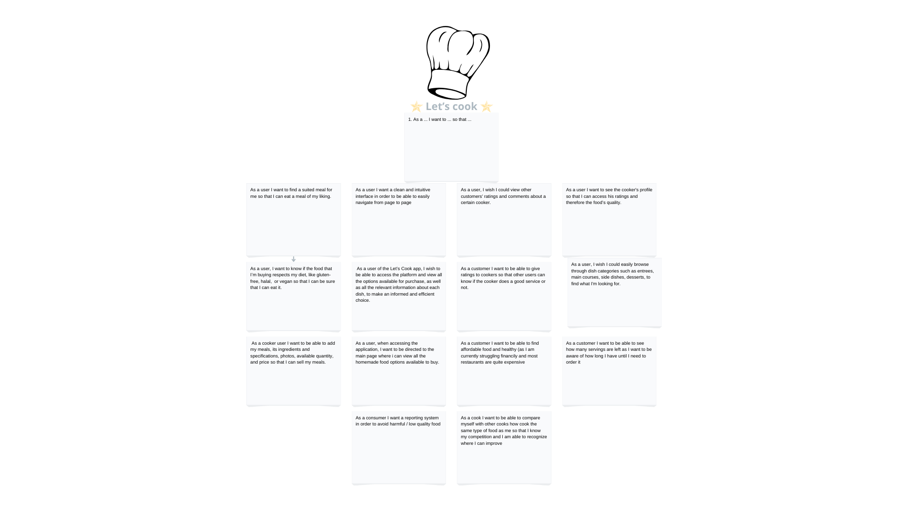

# Let's Cook

## Product Vision

Let's Cook is a revolutionary mobile application designed to connect students within FEUP to buy and sell homemade meals, reducing food waste while fostering a sense of community and culinary exploration. Targeted specifically towards students, Let's Cook addresses the common issue of excess food and tight budgets by providing a platform for convenient and sustainable food sharing.

Unlike food delivery apps, like Uber Eats and Glovo, that focus on selling restaurant food, Let's Cook is centered around a marketplace for healthy and cheap homemade meals made by students and for students.

## Initial list of high-level features
- Sign In Page and Sign Up Page
- Home Page
- Menu for navigation
- User profile
- Search bar with many filters ( food restrictions or diets, location preferences, price filtering , ratings and cook)
- Scrolldown list of offers with a appealing photo, price, rating, cook
- Dish Page extended version of the menu
- Cook Page photo,description, experience, rating
- About Page

## list of assumptions and dependencies
- Firebase

## User stories

## Domain diagram

## Authored by :
- Allan Santos (up202109243)
- Filipe Gaio (up202204985)
- Henrique Fernandes (up202204988)
- José Sousa (up202208817)
- Leandro Martins (up202208001)