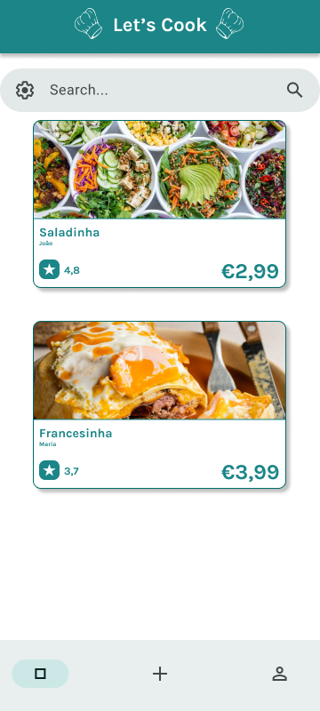

# Let's Cook Development Report

Welcome to the documentation pages of the Let's Cook App!

You can find here details about the the Let's Cook App, from a high-level vision to low-level implementation decisions, a kind of Software Development Report, organized by type of activities:

* [Business modeling](https://github.com/FEUP-LEIC-ES-2023-24/2LEIC16T2#Business-Modelling)
  * [Product Vision](https://github.com/FEUP-LEIC-ES-2023-24/2LEIC16T2#Product-Vision)
  * [Features and Assumptions](https://github.com/FEUP-LEIC-ES-2023-24/2LEIC16T2#Features-and-Assumptions)
  * [Elevator Pitch](https://github.com/FEUP-LEIC-ES-2023-24/2LEIC16T2#Elevator-pitch)
* [Requirements](https://github.com/FEUP-LEIC-ES-2023-24/2LEIC16T2#Requirements)
  * [User stories](https://github.com/FEUP-LEIC-ES-2023-24/2LEIC16T2/issues?q=is%3Aissue+sort%3Aupdated-desc+label%3Astory)
  * [Domain model](https://github.com/FEUP-LEIC-ES-2023-24/2LEIC16T2#Domain-model)
* [Architecture and Design](https://github.com/FEUP-LEIC-ES-2023-24/2LEIC16T2#Architecture-And-Design)
  * [Logical architecture](https://github.com/FEUP-LEIC-ES-2023-24/2LEIC16T2#Logical-Architecture)
  * [Physical architecture](https://github.com/FEUP-LEIC-ES-2023-24/2LEIC16T2#Physical-Architecture)
  * [Vertical prototype](https://github.com/FEUP-LEIC-ES-2023-24/2LEIC16T2#Vertical-Prototype)
* [Project management](https://github.com/FEUP-LEIC-ES-2023-24/2LEIC16T2#Project-Management)

Contributions are expected to be made exclusively by the initial team, but we may open them to the community, after the course, in all areas and topics: requirements, technologies, development, experimentation, testing, etc.

Please contact us!

Thank you!

## Authored by

* Allan Santos (up202109243)
* Filipe Gaio (up202204985)
* Henrique Fernandes (up202204988)
* José Sousa (up202208817)
* Leandro Martins (up202208001)

---

## Business Modelling

### Product Vision

Let's Cook is a revolutionary mobile application designed to connect students within FEUP to buy and sell homemade meals, reducing food waste while fostering a sense of community and culinary exploration. Targeted specifically towards students, Let's Cook addresses the common issue of excess food and tight budgets by providing a platform for convenient and sustainable food sharing.

### Features and Assumptions

* Sign In Page and Sign Up Page
* Home Page
* Menu for navigation
* User profile
* Search bar with many filters ( food restrictions or diets, location preferences, price filtering , ratings and cook)
* Scrolldown list of offers with a appealing photo, price, rating, cook
* Dish Page extended version of the menu
* Cook Page photo,description, experience, rating
* About Page

### Elevator Pitch

Draft a small text to help you quickly introduce and describe your product in a short time (lift travel time ~90 seconds) and a few words (~800 characters), a technique usually known as elevator pitch.

Take a look at the following links to learn some techniques:

* [Crafting an Elevator Pitch](https://www.mindtools.com/pages/article/elevator-pitch.htm)
* [The Best Elevator Pitch Examples, Templates, and Tactics - A Guide to Writing an Unforgettable Elevator Speech, by strategypeak.com](https://strategypeak.com/elevator-pitch-examples/)
* [Top 7 Killer Elevator Pitch Examples, by toggl.com](https://blog.toggl.com/elevator-pitch-examples/)

## Requirements

In this section, you should describe all kinds of requirements for your module: functional and non-functional requirements.

### Domain model

* #### User

A user is basically a student who's either buying or selling food. Each user has a profile with stuff like their name, ID, if they're active or not, and where they are on campus. Plus, they can share a bit about themselves, their food tastes, and what they're selling or looking to buy.

* #### Seller

A seller is typically a university student eager to share their culinary skills and earn some extra money. Each seller has in addition to the User fiels, a sellerId, a deliverRadius (where they deliver food), their average rating, their specialities and their sales record. After getting accepted he can post a variety of dishes for sale,

* #### Buyer

A buyer is essentially a university student seeking convenient and tasty food options within their campus community. Each buyer has in addition to the User fields, a BuyerId and its BuyingHistory. He can also follow his favourite sellers.

* #### Admin

An admin plays a crucial role in ensuring smooth operations and maintaining a safe and enjoyable experience for all users. Admins are responsible for managing the platform, monitoring user activity, and addressing any issues or concerns that may arise. They have a GodToken which gives them special privileges like being able to ban any user and allowing users to sell products.

* #### Dish

A dish is the star of the show, enticing buyers with its delicious flavors. Each dish listed on the platform represents a culinary creation crafted by a talented seller within the university community. It is described by its name, ingredients, calories and if it is available at the moment. Each Dish may belong to different diets

* #### Diet

Each diet is represented by its name and by a description which may contain specific information about such diet like the foods that are allowed, where it originates from and potencial benefits it has.

## Architecture and Design

The architecture of a software system encompasses the set of key decisions about its overall organization.

A well written architecture document is brief but reduces the amount of time it takes new programmers to a project to understand the code to feel able to make modifications and enhancements.

To document the architecture requires describing the decomposition of the system in their parts (high-level components) and the key behaviors and collaborations between them.

In this section you should start by briefly describing the overall components of the project and their interrelations. You should also describe how you solved typical problems you may have encountered, pointing to well-known architectural and design patterns, if applicable.

### Logical architecture

For us to have a good organization of our code for easier maintenance, we divided our project in the following sections:

* Let’s Cook:This package is the global package for our phone application, it has the other packages of our system.

* Let’s Cook UI:  This package is focused on the frontend of our application, it includes the components of the user interface.

* Let’s Cook Business Logic: This is the package that includes the user business logic, it also includes API calls to the backend of the application.

* Let’s Cook Database Schema: This package contains the local database logic and API.

* External Services: This package is the global package for external services application depends on. It includes the other logical packages of our system.

### Physical architecture

Our app's physical architecture comprises the user device housing the frontend application and local storage, along with external services provided by Firebase. These services include hosting a NoSQL database, authentication, and storage functionalities.

### Vertical prototype

We developed the following features for the prototype:

* #### Navigation

We developed a navigation bar that allows the user to navigate between different pages.

* #### Design

We styled different widget using material design and in some cases we used custom seeds for the color scheme

* #### Authentication

We developed Login/Register functionality using Firebase Auth. The user is able to register using a Google account or an email/password.

* #### Database

We built a custom database with Firebase Firestore that allows us to save data about users, dishes, and others and automatically sync the data with each client.

## Project management

Software project management is the art and science of planning and leading software projects, in which software projects are planned, implemented, monitored and controlled.

In the context of ESOF, we recommend each team to adopt a set of project management practices and tools capable of registering tasks, assigning tasks to team members, adding estimations to tasks, monitor tasks progress, and therefore being able to track their projects.

Common practices of managing iterative software development are: backlog management, release management, estimation, iteration planning, iteration development, acceptance tests, and retrospectives.

You can find below information and references related with the project management in our team:

* Backlog management: Product backlog and Sprint backlog in a [Github Projects board](https://github.com/orgs/FEUP-LEIC-ES-2023-24/projects/64);
* Release management: [v0](#), v1, v2, v3, ...;
* Sprint planning and retrospectives:
  * plans: screenshots of Github Projects board at begin and end of each iteration;
  * retrospectives: meeting notes in a document in the repository;
